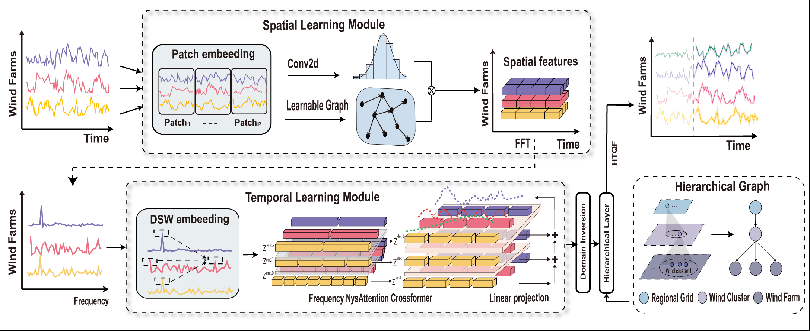

# Spatio-temporal Hierarchical Forecasting using Group-Feature Graph Convolutional Network for Probabilistic Wind Power Prediction

## Abstract
Large-scale wind power grid integration exhibits distinctive spatio-temporal  coupling characteristics and manifests a hierarchical structure across multiple system levels. Independent prediction models operating at separate hierarchical levels tend to produce system-level inconsistencies through uncoordinated estimations, while the inherent spatiotemporal interdependencies and aggregation dynamics of wind farm clusters fundamentally complicate the creation of probabilistic forecasts that satisfy multi-level operational constraints. To address the challenges, a novel spatio-temporal hierarchical forecasting framework is proposed to conduct probabilistic predictions for multi-level wind power. The framework integrates a group-feature graph convolutional network to extract the unidirectional topological structure from historical wind power patches. Built upon Crossformer, we introduce an innovative frequency de-biasing strategy coupled with a two-stage frequency-domain attention mechanism, enabling unified cross-band feature learning while effectively mitigating spectral bias. In addition, to ensure forecast consistency and robustness, the framework incorporates coherent reconciliation constraint layer and introduces a heavy-tailed quantile loss function for simultaneous multi-quantile regression across all system levels. Comprehensive evaluations on two real-world wind power datasets demonstrate the superior performance of the framework, establishing it as one of the pioneering hierarchical probabilistic forecasting systems capable of maintaining cross-level consistency for wind power prediction.

Please stay tuned for updates!

 
    

